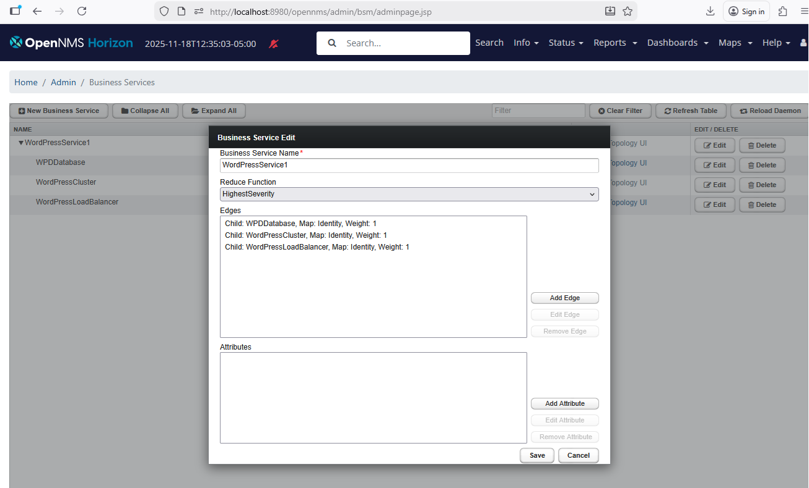

[Main Menu](../README.md) | [Session 2](../session2/README.md) | [Exercise-2-3-business-service-monitoring](../session2/Exercise-2-3-business-service-monitoring1.md)

# Exercise Business Service Monitoring

We have seen that we can monitor various components of a service but we need to combine all of those indications into an overall customer impact on the service being managed. 

OpenNMS monitors `resource facing services` i.e. services provided within the providers network on specific components. 
However, a `customer facing service` is usually provided as an aggregation of multiple resource faceing services.

OpenNMS provides a [Business Service Monitoring](https://docs.opennms.com/horizon/33/operation/bsm/introduction.html) feature which allow us to create a service graph relating `resource facing services` to the `customer facing services` they support.

## Creating a business service

We want the `WordPressCluster` service to propogate a `major` alarm when all three wordpress services are down but only a `minor` alarm when less than three wordpress server are down. 
We want the service problem alarm to clear when all three server are working.

The documentation is a little obscure but I found that the following cofiguration works.

Navigate using the cogs to the admin page and select `business service monitoring`

We will create a parent service with three child services as shown below


You will need to create the child services before creating the parent service




the `WordPressCluster` service contains three IP service children, one for each wordpress server.


The `base number` is `3` and the aggregation type is `Exponential`

Each ip service child edge is mapped with 'decrease' 


Try stopping one wordpress server. 
Wait for 5 minutes and see what alarms occur.

```
docker compose stop wordpress1
```


Try stopping a second wordpress server. 
Wait for 5 minutes and see what alarms occur.

```
docker compose stop wordpress2
```


Try stopping all of the wordpress servers. 
Wait for 5 minutes and see what alarms occur.
```
docker compose stop wordpress3
```


Restart all the wordpress servers and see if the alarms disappear.
```
docker compose up -d
```


